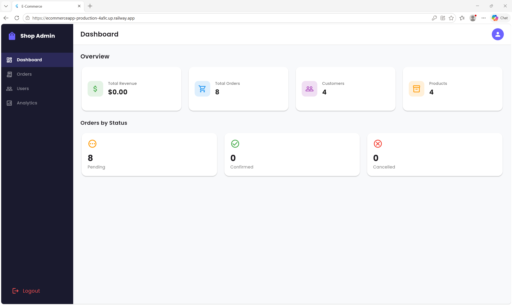
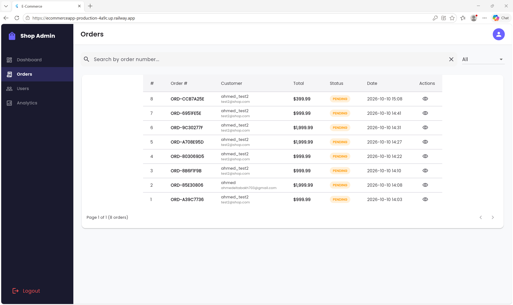
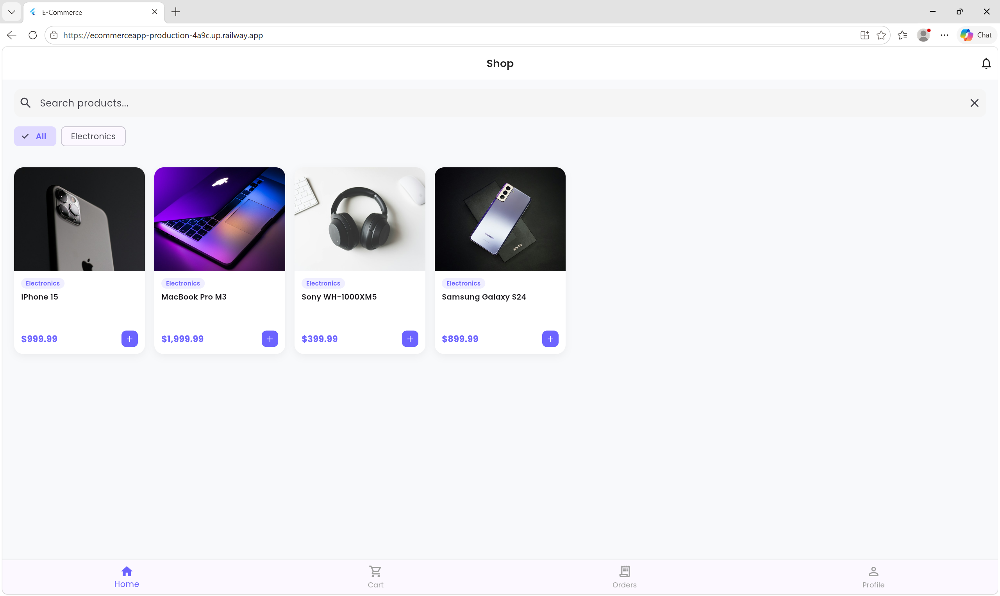
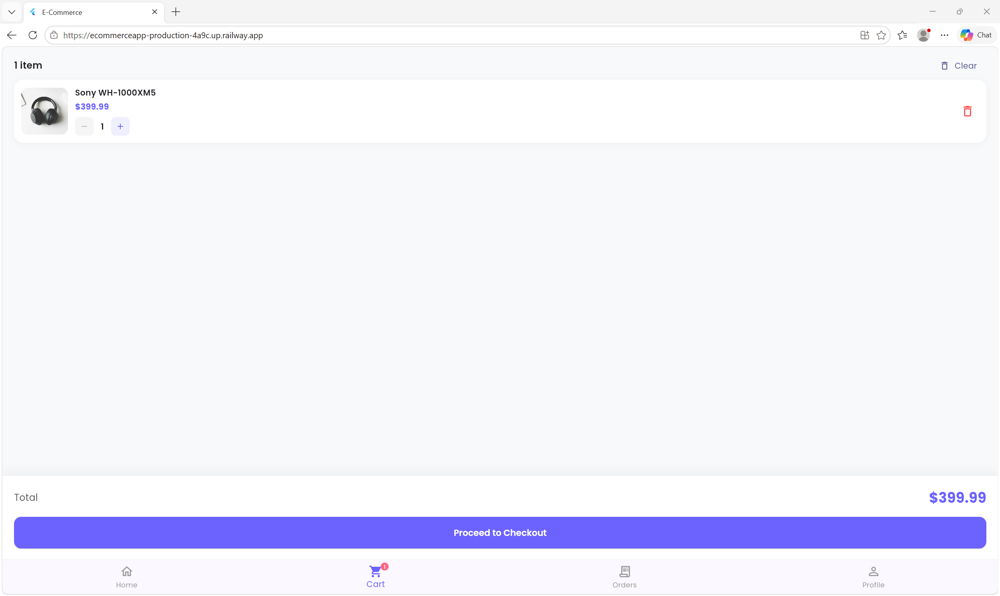
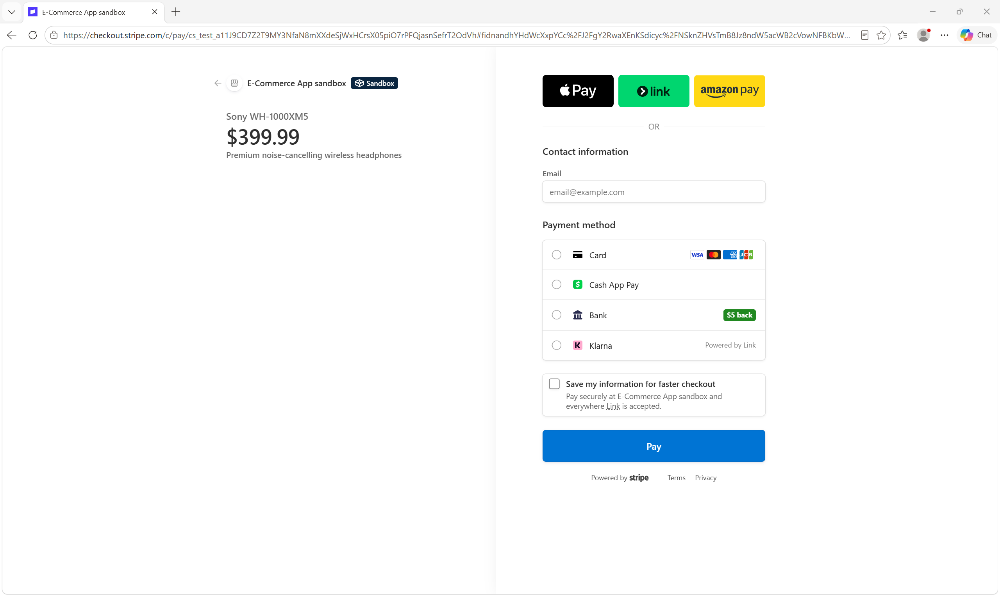
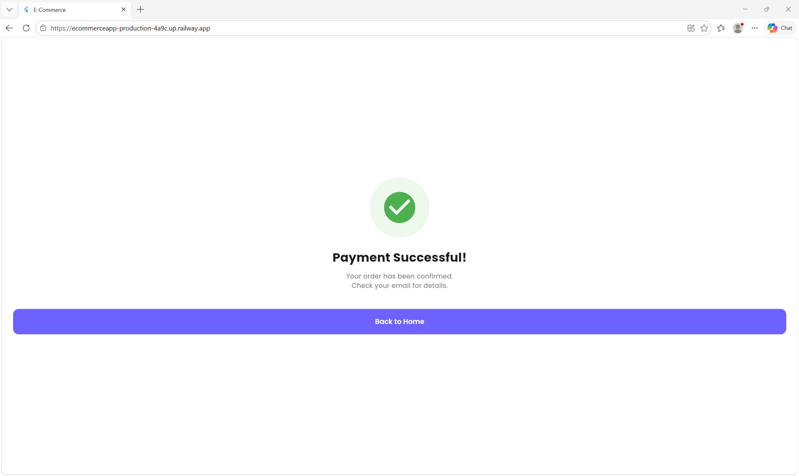

# 🛍️ E-Commerce Platform

A **full-stack e-commerce platform** built with **Spring Boot 4** and **Flutter Web**, combining a customer storefront and an admin dashboard in a single application.

The platform features JWT authentication, product and order management, Stripe payments, caching, asynchronous messaging, sales analytics, and cloud deployment.

<p align="center">
  <a href="https://ecommerceapp-production-4a9c.up.railway.app">
    
  </a>
  <a href="https://ecommerceapp-production-5c76.up.railway.app/swagger-ui.html">
    
  </a>
  <a href="https://github.com/ahmedshawky7/ecommerce_app">
    
  </a>
</p>

---

## 📑 Table of Contents

- [Features](#-features)
- [Tech Stack](#️-tech-stack)
- [Architecture](#️-architecture)
- [Screenshots](#-screenshots)
- [Getting Started](#-getting-started)
- [Stripe Payment Testing](#-stripe-payment-testing)
- [Project Structure](#-project-structure)
- [API Endpoints](#-api-endpoints)
- [Security](#-security)
- [Author](#-author)
- [License](#-license)

---

## ✨ Features

### 🛒 Customer Store

- **Authentication** — JWT-based authentication with refresh tokens.
- **Product Browsing** — Browse products using a grid layout.
- **Search & Filtering** — Search products and filter by category.
- **Product Details** — View images, descriptions, prices, stock, and seller information.
- **Shopping Cart** — Add products, update quantities, and remove items.
- **Checkout** — Shipping information and Stripe payment integration.
- **Order History** — View previous orders and cancel eligible pending orders.
- **Profile Management** — Manage account information and log out.

### 🔐 Admin Dashboard

- **Dashboard Overview** — Monitor revenue, orders, customers, and products.
- **Order Management** — View, filter, and update customer orders.
- **User Management** — Search users, view accounts, and manage account status.
- **Sales Analytics** — Visualize daily sales and revenue by category.
- **Product Management** — Create, update, and delete products.

### 🎯 Role-Based Navigation

The application directs authenticated users to the appropriate interface based on their role.

| Role | Destination |
|---|---|
| `ADMIN` | Admin Dashboard |
| `CUSTOMER` | Customer Store |

Backend authorization protects restricted operations independently of frontend navigation.

---

## 🛠️ Tech Stack

| Layer | Technologies |
|---|---|
| Backend | Java 17+, Spring Boot 4, Spring Security |
| Database | MySQL 8, Spring Data JPA |
| Caching | Redis |
| Message Queue | RabbitMQ, CloudAMQP |
| Image Storage | Cloudinary |
| Payments | Stripe Checkout, Stripe Webhooks |
| Authentication | JWT, Refresh Tokens |
| Frontend | Flutter Web, Dart, Bloc/Cubit |
| API Documentation | Swagger UI, OpenAPI 3 |
| Deployment | Railway, CloudAMQP |

---

## 🏗️ Architecture

```text
                   ┌────────────────────────┐
                   │      Flutter Web       │
                   │                        │
                   │   Customer Store        │
                   │   Admin Dashboard       │
                   └────────────┬───────────┘
                                │
                             REST API
                                │
                                ▼
                   ┌────────────────────────┐
                   │   Spring Boot Backend  │
                   │                        │
                   │ REST Controllers       │
                   │ Business Services      │
                   │ Spring Security + JWT  │
                   │ Order & Payment Logic  │
                   └────────────┬───────────┘
                                │
                ┌───────────────┼──────────────┐
                │               │              │
                ▼               ▼              ▼
          ┌──────────┐    ┌──────────┐   ┌──────────┐
          │  MySQL   │    │  Redis   │   │ RabbitMQ │
          │ Database │    │  Cache   │   │ Messaging│
          └──────────┘    └──────────┘   └──────────┘

                   ┌────────────────────────┐
                   │         Stripe         │
                   │    Checkout + Events   │
                   └────────────┬───────────┘
                                │
                             Webhooks
                                │
                                ▼
                      Spring Boot Backend

              Cloudinary → Product Image Storage
```

---

## 📸 Screenshots

### 🔐 Admin Dashboard

**Dashboard Overview**



**Orders Management**



---

### 🛒 Customer Store

**Product Catalog**



**Shopping Cart**



**Checkout**



**Payment Success**



---

## 🚀 Getting Started

### Prerequisites

Make sure you have the following installed:

- Java 17 or later, compatible with the configured Spring Boot version.
- Maven or the included Maven Wrapper.
- Flutter SDK 3.47 or later.
- Docker and Docker Compose.
- Stripe test account and API credentials.

Cloudinary and email credentials may also be required depending on the enabled features.

### 1. Clone the Repository

```bash
git clone https://github.com/ahmedshawky7/ecommerce_app.git
cd ecommerce_app
```

### 2. Start Infrastructure

Run this command from the directory containing `docker-compose.yml`:

```bash
docker compose up -d
```

This starts the services defined in your Docker Compose configuration.

### 3. Configure Environment Variables

Configure the backend environment variables for your local environment.

Example `.env` values:

```dotenv
DB_USERNAME=root
DB_PASSWORD=your_database_password

JWT_SECRET=your_base64_encoded_secret

MAIL_USERNAME=your_email@gmail.com
MAIL_PASSWORD=your_email_app_password

CLOUDINARY_CLOUD_NAME=your_cloud_name
CLOUDINARY_API_KEY=your_cloudinary_api_key
CLOUDINARY_API_SECRET=your_cloudinary_api_secret

STRIPE_API_KEY=sk_test_your_test_secret_key
STRIPE_WEBHOOK_SECRET=whsec_your_webhook_signing_secret
```

**Important:**

- Replace all placeholder values with your own credentials.
- Ensure Spring Boot actually loads the environment variables. A `.env` file is not automatically loaded by every Spring Boot configuration.
- Never commit real API keys, passwords, JWT secrets, or webhook signing secrets to GitHub.

### 4. Run the Backend

Navigate to the backend directory:

```bash
cd backend
```

**Windows CMD:**

```bat
mvnw.cmd spring-boot:run
```

**macOS / Linux:**

```bash
./mvnw spring-boot:run
```

The backend should run at:

`http://localhost:8080`

### 5. Run the Flutter Web Application

Open another terminal:

```bash
cd frontend_admin
flutter pub get
flutter run -d chrome
```

The application will launch in Chrome.

---

## 💳 Stripe Payment Testing

Use Stripe's test environment to test checkout without processing real payments.

### Test Card

| Field | Value |
|---|---|
| Card Number | `4242 4242 4242 4242` |
| Expiration Date | Any valid future date |
| CVC | Any valid three-digit value |
| ZIP / Postal Code | Any value if requested |

### Test the Checkout Flow

1. Register or log in as a customer.
2. Add products to the shopping cart.
3. Proceed to checkout.
4. Enter the Stripe test card details.
5. Complete the payment.
6. Verify that the backend processes the payment and updates the corresponding order.

### Test Webhooks Locally

Start the Stripe CLI listener:

```bash
stripe listen --events payment_intent.succeeded --forward-to localhost:8080/api/webhooks/stripe
```

Configure the `whsec_...` secret displayed by the CLI in your local backend environment.

Complete an actual test checkout to verify the end-to-end payment flow. Stripe CLI fixtures can also be used, provided they match the payment configuration and API version of your Stripe account.

**Note:** The listener above forwards `payment_intent.succeeded`. If your checkout implementation handles `checkout.session.completed` instead, configure the listener and backend to handle the event your application actually uses.

---

## 📁 Project Structure

```text
ecommerce_app/
│
├── backend/
│   └── src/
│       └── main/
│           ├── java/com/example/ecommerce/
│           │   ├── config/          # Application configuration
│           │   ├── controller/      # REST API controllers
│           │   ├── dto/             # Request and response objects
│           │   ├── entity/          # JPA entities
│           │   ├── exception/       # Exception handling
│           │   ├── repository/      # Data access layer
│           │   ├── security/        # JWT and security components
│           │   └── service/         # Business logic
│           │
│           └── resources/
│               └── application.properties
│
├── frontend_admin/
│   ├── lib/
│   │   ├── core/
│   │   │   ├── constants/
│   │   │   ├── network/
│   │   │   ├── storage/
│   │   │   ├── theme/
│   │   │   └── widgets/
│   │   │
│   │   └── features/
│   │       ├── auth/
│   │       ├── dashboard/
│   │       ├── orders/
│   │       ├── users/
│   │       ├── analytics/
│   │       ├── products/
│   │       ├── cart/
│   │       ├── checkout/
│   │       ├── customer_orders/
│   │       └── profile/
│   │
│   └── web/
│
├── docs/
│   └── screenshots/
│       ├── admin-dashboard.png
│       ├── admin-orders.png
│       ├── customer-shop.png
│       ├── customer-cart.png
│       ├── customer-checkout.png
│       └── payment-success.png
│
├── docker-compose.yml
└── README.md
```

---

## 🌐 API Endpoints

The following endpoints describe the documented API surface. Verify their paths and HTTP methods against the actual backend controllers.

### 🔑 Authentication

| Method | Endpoint | Description |
|---|---|---|
| `POST` | `/api/auth/register` | Register a new account |
| `POST` | `/api/auth/login` | Authenticate a user |
| `POST` | `/api/auth/refresh` | Refresh authentication tokens |

### 📦 Products & Categories

| Method | Endpoint | Description |
|---|---|---|
| `GET` | `/api/products` | Retrieve products |
| `GET` | `/api/products/{id}` | Retrieve product details |
| `GET` | `/api/products/search?keyword=` | Search products |
| `GET` | `/api/categories` | Retrieve categories |

### 🛒 Shopping Cart

| Method | Endpoint | Description |
|---|---|---|
| `GET` | `/api/cart` | Retrieve the current cart |
| `POST` | `/api/cart/items` | Add an item |
| `PUT` | `/api/cart/items/{id}` | Update an item |
| `DELETE` | `/api/cart/items/{id}` | Remove an item |

### 💳 Orders & Payments

| Method | Endpoint | Description |
|---|---|---|
| `POST` | `/api/orders/create-checkout-session` | Create a Stripe checkout session |
| `GET` | `/api/orders` | Retrieve the current user's orders |
| `PUT` | `/api/orders/{id}/cancel` | Cancel an eligible order |

### 🔐 Admin

| Method | Endpoint | Description |
|---|---|---|
| `GET` | `/api/admin/dashboard/stats` | Retrieve dashboard statistics |
| `GET` | `/api/admin/orders` | Retrieve and manage orders |
| `GET` | `/api/admin/users` | Retrieve and manage users |
| `GET` | `/api/admin/analytics/sales` | Retrieve sales analytics |

### 📚 API Documentation

Explore the API using Swagger UI:

[**Open Swagger UI**](https://ecommerceapp-production-5c76.up.railway.app/swagger-ui.html)

---

## 🔒 Security

- **JWT Authentication:** Short-lived access tokens and refresh tokens.
- **Role-Based Access Control:** Separate permissions for administrators and customers.
- **Password Protection:** Secure password hashing using an appropriate password encoder.
- **Webhook Verification:** Verify Stripe signatures before processing webhook events.
- **Environment Variables:** Keep sensitive credentials out of source control.
- **Order Integrity:** Validate payment amounts, currencies, and order ownership on the backend.
- **Production Security:** Use HTTPS and protect administrative endpoints with backend authorization.

Token expiration values and security behavior should reflect the actual application configuration.

---

## 👨‍💻 Author

**Ahmed Shawky**

- GitHub: [@ahmedshawky7](https://github.com/ahmedshawky7)
- Project Repository: [ecommerce_app](https://github.com/ahmedshawky7/ecommerce_app)
- Email: ahmedeltabakh703@gmail.com

---

## 📄 License

This project is licensed under the MIT License. See the [`LICENSE`](LICENSE) file for details.
